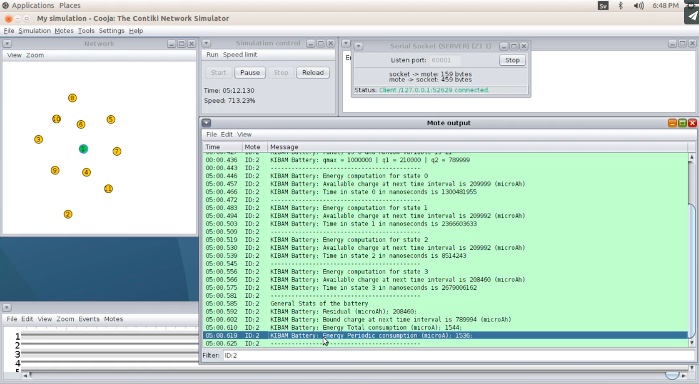

# PowertraceK
#### *It is a Powertrace extension that implements the Kibam Battery model*

---

|    | Features of PowertraceK                                                                          |
|----|--------------------------------------------------------------------------------------------------|
| 1. | It measures the energy consumption in Receive, Transmit, Low power and idle.                     |
| 2. | It provides the remaining energy in the battery of each node.                                    |
| 3. | It can be easily used for energy-harvesting nodes, where there is a charging electrical current. |

---
*[Wiki is online! Here you can find more information!](https://github.com/KineticBattery/Powertrace/wiki)*

---
[Here you will find a page similar to this where you can post questions!](https://arikerprojects.wordpress.com/powertracek)
---
### Some information
This code adds the Kinetic Battery model in the original Powertrace tool. So, it is possible to know periodically the remaining energy in the nodes. In harvesting or non-harvesting scenarios, the kinetic model is useful to measure the nodes' lifetime and/or the non-linear residual energy.

The PowertraceK code has been developed and tested on COOJA - Contiki.

This is a portion of code used to implement a Solution named: Neutral Operation of the Minimum Energy Node in Energy-Harvesting Environments. This work has been accepted in ISCC 2017, soon it will be in ieeexplorer.


If you use PowertraceK, don't forget to use the following bibtex entry to cite our paper.
```
@INPROCEEDINGS{riker2017iscc, 
author={Riker, Andr{\'e} and Curado, Marilia and Monteiro, Edmundo},
booktitle={2017 IEEE Symposium on Computers and Communication (ISCC)}, 
title={Neutral Operation of the Minimum Energy Node in Energy-Harvesting Environments}, 
year={2017}, 
pages={1-6},  
month={July}}
```

Citation for non-latex users:

```
A. Riker, M. Curado, and E. Monteiro, 
“Neutral Operation of the Minimum Energy Node in Energy-Harvesting Environments,” 
in 2017 IEEE Symposium on Computers and Communications (ISCC), IEEE, July 2017, pp. 1–6.
```


Please, feel free to modify the code to your needs and contact me any time to clear doubts or to upload improved versions of this code. My contact is ariker(at)dei.uc.pt


### Get Started


<b>Step 1) </b> 

Download Instant Contiki

https://sourceforge.net/projects/contiki/files/Instant%20Contiki/

To Watch a short video about this step, open the following link as a new tab:
https://vimeo.com/215535613

<b>Step 2) </b> 

Download or clone our git hub project 

To Watch a short video about this step, open the following link as a new tab:
https://vimeo.com/215535637


<b>Step 3) </b> 

Run the downloaded Instant Contiki Virtual Machine</b>

To Watch a short video about this step, open the following link as a new tab:
https://vimeo.com/215535582

<b>Step 4) </b> 

Replace the apps/powertrace files in the original Contiki by the ones provided in our git hub project

To Watch a short video about this step, open the following link as a new tab:
https://vimeo.com/215535658

<b>Step 5) </b> 

To run an example, replace the examples/er-rest-example files in the original Contiki by the ones provided in our git hub project


If you want to use PowertraceK in other application code, you just have to add the following include: 


```
#include "powertrace.h"
```


Then, call the following powertrace function inside the PROCESS_BEGIN() code:


```
PROCESS_BEGIN();
...

powertrace_start(CLOCK_SECOND * seconds, seconds, fixed_perc_energy, variation);
...

PROCESS_PAUSE();
```

In the Makefile you have to add:

```
TARGET_LIBFILES += -lm
```

and also add in the Makefile:

```
APPS += powertrace
```

<b>Step 6) </b>

Run Cooja simulation

To Watch a short video about this step, open the following link as a new tab:
https://vimeo.com/215535590

*If you have problems with MSPSIM running Cooja the first time, download the MSPSIM folder from Contiki's Git Hub and paste the files in Contiki/tools/MSPSIM*

### Default Settings:
The default capacity is 1000000 microAh or 1000 mAh.

The default node is Wismote, but it can also be easily changed.

### Changing Electrical Current to Run PowertraceK in other Hardware Platform (Skymote, TelosB, ...)
Someone can ask: "How can I change the default node?"

If you want to use PowertraceK in other node type you have to edit the following line code located at Powertrace/powertrace.c:

```
// Intiate the struct with the eletrical current values in microA 
// for the following states: active, low power CPU, Tx and Rx.
// Current values for Wismote (microA)
struct energy_states i_energyStt = {0.001200*1000000, 0.000090*1000000, 0.0336*1000000, 0.0185*1000000};
```

The values I provide here is compatible with Wismote. 


<b> Skymote </b>

Here I found the Skymote electrical current

http://www.eecs.harvard.edu/~konrad/projects/shimmer/references/tmote-sky-datasheet.pdf)

MCU on, Radio RX 21.8 mA

MCU on, Radio TX 19.5 mA

MCU on, Radio off 1800 μA

MCU standby 51 μA

With these values, the new line code for Skymote is:
```
struct energy_states i_energyStt = {0.0018*1000000, 0.000051*1000000, 0.0195*1000000, 0.0218*1000000};
```

### Changing the Settings of the Battery:
To run the PowertraceK, please follow the "Get Started" steps. These steps will show that you have to insert in your application code (among other things) the following lines:

```
unsigned seconds=60*5;// warning: if this variable is changed, then the kinect variable the count the minutes should be changed
double fixed_perc_energy = 0.2;// 0 - 1
unsigned variation = 2;//0 - 99

powertrace_start(CLOCK_SECOND * seconds, seconds, fixed_perc_energy, variation);
```
The variable "fixed_perc_energy" correspods to the variable that will tell the PowertraceK the percentage of energy the node will start, considering the full battery capacity is 1000000 microAh. For example, setting fixed_perc_energy = 0.2 means that the nodes will be initiated with 20 % of 1000000 microAh = 200000 microAh.

<b> 2 AA Batteries </b>

Many hardware platforms are designed for 2 AA batteries. To set PowertraceK to a capacity close to 2 AA batteries, you can set:

fixed_perc_energy = 4.0;

This will result in 4000000 microAh.

Any more questions, please contact me.
